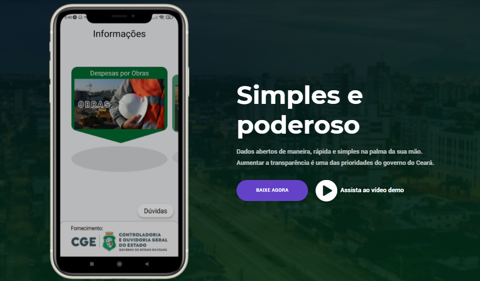

<h1 align="center">
    Ceará na mão
     
    
</h1>

<h4 align="right">
        Baixe o App agora para Android!
    

        
    

</h4>

<h3 align="center">
    Dados abertos de maneira, rápida e simples na palma da sua mão.
</h3>

  <a href="#Ceará-na-Mão---Propósito">Ceará na Mão - Nosso propósito</a>&nbsp;&nbsp;&nbsp;|&nbsp;&nbsp;&nbsp;
  <a href="#nosso-produto-resumo">Nosso Produto</a>&nbsp;&nbsp;&nbsp;|&nbsp;&nbsp;&nbsp;
  <a href="#tecnologias">Tecnologias</a>&nbsp;&nbsp;&nbsp;|&nbsp;&nbsp;&nbsp;
  <a href="#Nosso-time">Nosso time</a>&nbsp;&nbsp;&nbsp;|&nbsp;&nbsp;&nbsp;
  <a href="#Nossas-redes">Nossas redes sociais</a>&nbsp;&nbsp;&nbsp;|&nbsp;&nbsp;&nbsp;

## Link do nosso site:

https://ceara-na-mao-21.web.app/

## Confira um gif demonstrativo do aplicativo

## Confira um vídeo demonstrativo do aplicativo no youtube:

<a href="https://www.youtube.com/watch?v=257sCZVvk30&ab_channel=W8Jonas">clique aqui</a>

## Ceará na Mão - Propósito
Nosso propósito
 

## Nosso produto (Resumo)
Nosso produto
 

## Tecnologias

Temos dois projetos, um aplicativo e um website.
O aplicativo, nosso principal foco, foi desenvolvido utilizando como principal linguagem o **Javascript**, usando o framework **React-Native** e **Expo**, além de **Firebase** no backend.

Já a lading-page foi desenvolvida utilizando **Javascript** e **Firebase** para hosting.

Escolhemos essa stack por dois motivos principais: Nos garante desenvolvimento de uma plataforma consistente tanto no Android quanto em dispositivos Iphone, além de proporcionar um desenvolvimento mais rápido, mas sem perder performance. O mesmo é válido para o site.

  
Aplicativo

 - Javascript
 - Lottie animations
 - React Navigation
 - expo linear gradient
 - expo font

  
Site

 - Javascript
 - Firebase Hosting
 - Html, CSS, Bootstrap, jquery e afins

 

## Nosso time:

Ana Terra Cotta – Profissional de Publicidade, autista, que luta por educação mais inclusiva baseada em sua própria vivência.  
Jonas Nascimento – Desenvolvedor e Empreendedor na área de Educação Digital.  
Laís Cosmo Lopes – Profissional de Marketing e Empreendedora na área de Educação Digital.  
Victor Ferreira – Gerente de produto e empreendedor educação digital. 

O desafio do SENAC trouxe como dor a **necessidade da interação entre alunos presenciais e alunos no digital**, de maneira que conseguisse passar a experiência SENAC de vivenciar o curso, além de ser uma plataforma que possua alto nível de segurança. 

Mediante esse problema nossa solução foi criar a edukaALL. EdukaALL é um aplicativo híbrido (iphone e android) white label voltado à gamificação e interação entre alunos de um determinado curso ou escola.

 

## Nossas-redes:

Você pode acessar nossas redes pelos botões abaixo: (CTRL + click)

Ana Terra Cotta: &nbsp;&nbsp;&nbsp;&nbsp;
&nbsp;&nbsp;&nbsp;

Jonas Nascimento:&nbsp;
&nbsp;&nbsp;&nbsp;
&nbsp;&nbsp;&nbsp;

Laís Cosmo Lopes:&nbsp;
&nbsp;&nbsp;&nbsp;

Victor Ferreira:&nbsp;&nbsp;&nbsp;&nbsp;&nbsp;&nbsp;&nbsp;
&nbsp;&nbsp;&nbsp;

 
